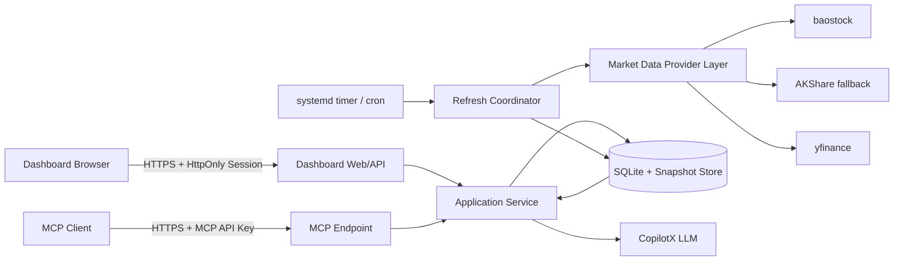

# TideWatch 可靠性重构与 Dashboard 上线方案

日期：2026-08-06
状态：Implemented / Production
适用范围：TideWatch MCP Server、数据采集、缓存、定时任务、Dashboard、线上认证与部署

## 1. 决策摘要

TideWatch 从“浏览器直接调用 MCP、请求触发实时抓取”调整为：

> 后台受控采集并持久化数据，MCP 与 Dashboard 读取带来源、时间和质量状态的数据产品。

Dashboard 仅供 Polly 自己使用，部署到 `https://tidewatch.polly.wang/`。采用单一访问验证码登录；验证码仅提交给服务端并换取 HttpOnly Session Cookie，浏览器不保存验证码，也永远拿不到 MCP API Key。

本次重构按以下顺序推进：

1. 止住 baostock 重试风暴和假成功。
2. 建立统一的数据状态与缓存契约。
3. 将扫描、详情分析和 cron 改造成可观测、可限流、可降级的后台数据管线。
4. 修复 Dashboard 的缓存语义、竞态和状态残留。
5. 增加服务端 Session 门禁并上线 Dashboard。

## 2. 当前问题与目标

### 2.1 已确认的问题

- Azure 出口被 baostock 判为“黑名单用户”。最近一小时曾出现 505 次登录失败、96 次级联重连。
- `_bs_login()` 失败只写日志，调用方仍打印“重连成功”，形成假成功和重试风暴。
- 普通 A 股没有可用的日线二级数据源；baostock 失败后核心分析整体失效。
- `scan_market` 的 warmup、SWR、force refresh 和 cron 可能并发执行，没有完整 singleflight。
- `analyze_stock` 每次创建 ThreadPoolExecutor，超时 future 仍在后台运行。
- 磁盘缓存重启后被标成“刚缓存”；前端又用 localStorage 写入时间代替数据时间。
- MCP 工具混用成功对象、`{"error": ...}`、局部 error 和 degraded 报告。
- cron 只检查 JSON-RPC 是否含 `result`，业务失败仍记录为 OK。
- Dashboard 手动刷新拿到旧缓存仍提示“数据已更新”，并存在请求乱序和旧状态残留。
- 日志重复写入且没有轮转，生产日志已超过 200 MB。

### 2.2 成功目标

- 单一数据源故障不会触发请求风暴，也不会阻塞 Dashboard。
- 每个响应明确说明：数据状态、数据时间、来源、年龄、是否正在刷新。
- 缓存过旧时不输出伪装成实时的交易方向。
- Dashboard 首屏 P95 小于 2 秒；详情缓存命中 P95 小于 2 秒。
- 用户能一眼区分“最新、缓存、降级、不可用”。
- cron 业务失败必须非零退出并产生可检索告警。
- 未登录浏览器无法访问 Dashboard 数据接口，前端包中不存在 MCP API Key 或验证码。

## 3. 目标架构



### 3.1 路由边界

- `/`：登录后 Dashboard 页面。
- `/assets/*`：静态 CSS/JS，可公开访问但不含秘密。
- `/api/auth/login`：验证码换 Session Cookie。
- `/api/auth/session`：检查当前会话。
- `/api/auth/logout`：清除 Cookie。
- `/api/dashboard/overview`：Dashboard 首屏快照。
- `/api/dashboard/stocks/{symbol}`：详情报告。
- `/api/dashboard/signals`：信号复盘。
- `/api/dashboard/refresh`：手动请求刷新，仅触发 singleflight，不等待全量抓取。
- `/mcp`：保留 MCP 客户端入口，只接受现有 MCP API Key，不接受 Dashboard Session。
- `/health`：仅返回 `ok/version`，不暴露工具数量和业务计数。

Dashboard 不再直接构造 MCP JSON-RPC，也不再持有 `X-API-Key`。

## 4. 后端可靠性设计

### 4.1 Provider 状态机与熔断

为每个数据源维护状态：

```text
CLOSED -> 连续失败达到阈值 -> OPEN
OPEN -> 冷却期结束 -> HALF_OPEN
HALF_OPEN -> 单次探测成功 -> CLOSED
HALF_OPEN -> 失败 -> OPEN
```

建议参数：

- baostock 连续 2 次登录失败即 OPEN。
- “黑名单用户”属于明确不可重试错误，立即 OPEN 30 分钟。
- 网络超时先 OPEN 5 分钟，指数退避最高 30 分钟。
- OPEN 期间所有 A 股请求直接走本地快照或备选源，禁止再次登录。
- `_bs_login()` 返回显式结果或抛出 `ProviderUnavailable`，禁止日志后静默继续。
- 只有真实查询成功后才能记录“恢复成功”。

### 4.2 数据源策略

普通 A 股日线：

1. 最近成功 K 线快照，若已覆盖目标交易日则直接使用。
2. baostock（熔断器允许时）。
3. AKShare `stock_zh_a_hist` 作为受限 fallback，仅单票、低并发调用。
4. 所有网络源失败后使用未超龄的本地 K 线快照。
5. 快照也超龄则返回 unavailable，不给方向性结论。

ETF：AKShare ETF 接口 + 最近成功快照。
美股：yfinance + 最近成功快照。

每次成功获取 K 线后按 symbol 原子写入 `data/market_cache/{market}/{symbol}.parquet` 或 SQLite。建议优先 SQLite，便于事务、查询和备份；K 线表主键为 `(market, symbol, date)`。

### 4.3 全局受限执行器

- 删除每次 `analyze_stock` 新建 ThreadPoolExecutor 的模式。
- 创建全局 `ThreadPoolExecutor(max_workers=6)`。
- 网络数据源再按 provider 设 Semaphore：baostock=1、AKShare=2、yfinance=2。
- 可选维度超时只产生 partial 状态，不拖垮核心 K 线分析。
- 核心 future 的 TimeoutError/异常统一转为结构化状态。
- 服务关闭时优雅 shutdown；不允许遗留无限增长的线程。

### 4.4 扫描 singleflight

所有 `_run_scan_warmup` 入口统一经过 `ScanCoordinator`：

- 同一时刻最多一个 scan 执行。
- 第二个 refresh 请求立即得到当前快照和 `refreshing=true`。
- `force_refresh` 也只加入同一个 in-flight，不另起扫描。
- 每次扫描生成 `generation_id`；只有最新 generation 可以覆盖 active snapshot。
- 结果先写临时文件/事务，完成后原子切换。
- 扫描成功率低于阈值时保留旧 snapshot，并记录本次失败状态，不覆盖数据时间。

### 4.5 数据质量与缓存契约

所有 Dashboard/MCP 读接口统一包含：

```json
{
  "meta": {
    "status": "fresh | stale | degraded | partial | unavailable",
    "data_timestamp": "2026-08-06T15:35:00+08:00",
    "generated_at": "2026-08-06T15:35:03+08:00",
    "age_seconds": 3,
    "source": ["baostock", "akshare"],
    "refreshing": false,
    "generation_id": "scan-20260806-153500",
    "warnings": []
  },
  "data": {}
}
```

语义：

- `fresh`：目标交易日数据完整。
- `stale`：数据完整但不是目标交易日；允许展示，显著标明时间。
- `degraded`：使用缓存或备选源，关键维度缺失。
- `partial`：核心 K 线有效，资金/新闻等可选维度失败。
- `unavailable`：没有足够数据，不输出评分和交易方向。

硬规则：

- 磁盘缓存恢复时，以内容中的 `data_timestamp` 计算年龄，不能把 monotonic 设为“新数据”的证据。
- localStorage 只用于快速绘制，不参与数据是否新鲜的判定。
- 超过最近一个有效交易日的 K 线，不生成新的信号记录。
- 降级详情可展示上次评分，但必须带 snapshot 时间，且不调用 LLM 再包装为实时判断。

## 5. MCP 契约重构

### 5.1 统一返回类型

每个工具都使用统一 envelope，不再把 `error` 随意塞进成功对象：

```json
{
  "ok": true,
  "meta": {},
  "data": {}
}
```

可恢复业务失败：

```json
{
  "ok": false,
  "error": {
    "code": "PROVIDER_UNAVAILABLE",
    "message": "A股行情源暂不可用",
    "retryable": true,
    "retry_after_seconds": 900
  },
  "meta": {}
}
```

参数错误与权限错误走 MCP tool error；部分成功使用 `ok=true + meta.status=partial`。

### 5.2 兼容迁移

- 第一阶段保留现有字段，同时新增 `ok/meta/data`。
- Dashboard 先迁移到新 `/api/dashboard/*`，不再依赖旧 MCP 结构。
- MCP smoke tests 和真实客户端完成迁移后，再在主版本升级中移除旧顶层字段。

## 6. 定时任务与运维

### 6.1 任务职责

消除双层 cron 重复分析：

- TideWatch 定时任务只负责：采集 K 线、生成 scan snapshot、更新信号结果。
- Jerry 只读取 TideWatch 已生成的快照/报告，生成微信叙事和图表。
- LLM 完整分析只在确有新数据时执行一次，不由两个 cron 重复触发。

建议将 crontab 迁移到 systemd timer，获得明确的超时、重启和日志状态。

### 6.2 cron 成功判定

- 检查 HTTP 状态、JSON-RPC error、`result.isError`、业务 `ok`。
- 任一步失败即非零退出。
- scan 后断言 `data_timestamp` 是目标交易日、scanned/total 达阈值。
- analyze 后断言不是 unavailable，且信号是否允许落库由数据质量决定。
- 日报记录结构化摘要，不只写 OK/FAILED。

### 6.3 日志与指标

- 应用只写 stderr，由 systemd/journald 管理；移除重复 FileHandler，或改 RotatingFileHandler。
- 若保留文件日志：单文件 20 MB、保留 7 份、压缩。
- Nginx 与应用日志都配置 logrotate。
- 关键指标：provider state、失败次数、熔断剩余时间、snapshot age、scan coverage、in-flight scan、executor queue、LLM 调用数。
- `/health` 只表示进程存活；新增鉴权后的 `/api/dashboard/system-status` 展示数据健康度。

## 7. Dashboard 产品与交互设计

### 7.1 首屏信息层级

顶部增加统一“数据状态条”，不再只显示模糊的“上次扫描”：

- 绿色：今日收盘数据 · 15:35 更新。
- 琥珀：缓存数据 · 6 小时前 · 后台刷新中。
- 红色：行情源不可用 · 数据停留在 08-05。
- 灰色：休市 · 最近交易日数据。

刷新按钮状态：

- `刷新`：可触发。
- `正在刷新`：singleflight 已运行，不可重复点击。
- `已是最新`：timestamp 未变化但已确认目标交易日。
- `数据源不可用`：显示下次探测时间，不制造“刷新成功”假象。

### 7.2 前端状态模型

- `refreshAll` 使用单飞 Promise + requestId，只接受最新响应。
- Signal Review 使用独立 requestId/AbortController。
- 详情 LLM 请求绑定 detailRequestId，不能只比较股票代码。
- 每次 render 前重置持仓总值、浮盈、现金、自选 section 和计数，防止旧 DOM 残留。
- Review 统计与卡片使用同一去重规则。
- localStorage 保存 `{data, data_timestamp, saved_at, schema_version}`；只用于秒开，不决定 fresh/stale。
- Schema 版本变化或数据超过硬年龄时自动丢弃。

### 7.3 详情面板

- 完整报告：四维数据 + AI 分析。
- partial：技术面正常，缺失维度显示“本次未取得”，不显示 `--` 冒充正常值。
- degraded：明确展示快照时间和来源，模板叙事，不调用 LLM。
- unavailable：只显示错误原因、下次探测时间和最近可用快照入口，不显示评分 0。

### 7.4 可用性与可访问性

- 股票卡片改为可聚焦 button/role=button，支持 Enter/Space。
- tabs 增加 aria-selected/aria-controls。
- 详情使用 `role=dialog`、焦点陷阱、关闭后恢复触发卡片焦点。
- 登录页、错误页、空状态均在桌面和移动端验证无溢出。

## 8. 仅本人使用的线上门禁

### 8.1 认证方案

采用“单一验证码 -> 签名 Session Cookie”：

1. 环境变量保存 `TIDEWATCH_DASHBOARD_CODE_HASH`，使用 Argon2id 或 bcrypt hash，不保存明文。
2. 环境变量保存独立的 `TIDEWATCH_SESSION_SECRET`。
3. `POST /api/auth/login` 接收验证码，服务端恒定时间校验。
4. 成功后签发 30 天 Session Cookie：
   - `HttpOnly`
   - `Secure`
   - `SameSite=Strict`
   - `Path=/`
   - 有明确 `Max-Age`
5. Session payload 只含 `sub=polly`、iat、exp、session_version。
6. `POST /api/auth/logout` 清 Cookie。
7. 修改 `TIDEWATCH_SESSION_SECRET` 或 session_version 可让全部旧会话立即失效。

不采用 SpatialQA/XHSExtractor 当前的 localStorage key 模式，因为浏览器脚本、扩展或 XSS 可以读取它。

### 8.2 防暴力破解

- Nginx 对 `/api/auth/login` 限制为每 IP 每分钟 5 次，burst 3。
- 应用层连续失败增加指数延迟，并记录匿名化 IP hash。
- 错误统一显示“验证码不正确”，不泄露配置状态。
- 没配置 code hash 时，生产模式拒绝启动；本地开发可显式 `TIDEWATCH_AUTH_DISABLED=true`。

### 8.3 登录界面视觉

登录不是通用白色表单，而是沿用观潮 Dashboard 的轻量灰白系统：

- 全屏柔和雾灰背景和细微水平潮汐纹理。
- 中央窄面板，最大宽度 380px，圆角不超过 8px。
- 顶部使用“观潮”品牌与小型实时状态点。
- 单个验证码输入框，支持 Enter 提交、显示/隐藏切换。
- 按钮使用现有蓝色强调色，错误使用低饱和红色。
- 登录验证期间按钮保持固定尺寸并显示小型进度图标，避免布局跳动。
- 不在页面解释产品功能，只显示必要文案：`进入观潮`、`访问验证码`、错误信息。

## 9. 线上部署方案

### 9.1 Dashboard 文件归属

将当前博客根目录的 `static/tidewatch.html` 迁入 TideWatch 仓库，例如：

```text
src/tidewatch/web/
  index.html
  app.js
  styles.css
```

Dashboard 与服务端契约同仓、同版本发布，不再依赖本地 Zola，也不再被 `.gitignore` 隐藏。

### 9.2 Nginx

- `/mcp` 保留 MCP API Key 路由和 MCP 限流。
- `/api/auth/login` 使用严格登录限流。
- `/api/dashboard/*` 代理到应用并由 Session middleware 校验。
- `/` 和 `/assets/*` 提供 Dashboard 页面资源。
- CORS 改为同源；Dashboard API 不允许 `*`。
- MCP 若仍需跨域，单独对 `/mcp` 配置允许来源和 headers。
- 增加 CSP：默认 self，仅为实际字体/资源开白名单；最终尽量把字体本地化。

### 9.3 秘密轮换

上线前必须：

- 轮换当前已写入本地 HTML 的 MCP API Key。
- 新 key 只保存在服务端 `.env` 和 MCP 客户端配置中。
- Dashboard 走同源 Session，不知道 MCP key。
- 检查 git history、部署目录和浏览器 source map 中无 key。

## 10. 实施阶段与验收门

### Phase 0：事故止血（半天）

改动：

- `_bs_login()` 明确失败返回/抛错。
- 黑名单立即熔断 30 分钟。
- 删除每三只股票强制重连；每轮 scan 最多一次探测。
- 修复“重连成功”假日志。
- 暂停重复 cron，只保留一个数据任务。
- 配置日志轮转。

验收：

- baostock 黑名单持续一小时，登录尝试不超过 3 次。
- Dashboard 仍可在 2 秒内返回缓存快照。
- 日志不再出现失败后的“重连成功”。

### Phase 1：缓存与采集核心（1–2 天）

改动：

- Provider circuit breaker。
- 最近成功 K 线持久化。
- ScanCoordinator singleflight + generation。
- 全局受限执行器。
- 统一 meta/status 数据契约。

验收：

- 10 个并发 scan 请求只触发一次真实扫描。
- 服务重启后缓存年龄保持真实，不会重置为 0。
- 主数据源失败时，缓存未超龄则 degraded；超龄则 unavailable。
- 旧 generation 不能覆盖新 snapshot。

### Phase 2：MCP、cron 与测试（1 天）

改动：

- MCP envelope 和错误代码。
- daily 任务严格成功判定。
- Jerry 改为只读数据结果。
- 增加单元、集成和故障注入测试。

验收：

- `{"error": ...}` 不再被 cron 记为 OK。
- smoke test 不允许“任意 dict”通过。
- provider timeout、blacklist、partial、stale、unavailable 均有测试。

### Phase 3：Dashboard 状态重构（1–2 天）

改动：

- 迁入 TideWatch 仓库并拆分 HTML/CSS/JS。
- 新 Dashboard API。
- 数据状态条、可信刷新提示。
- 请求竞态、状态残留、review 去重和可访问性修复。

验收：

- Playwright 覆盖 fresh/stale/degraded/unavailable 四态。
- 快速连续刷新不会乱序覆盖。
- 持仓/自选从有到无不会残留。
- 桌面与移动 viewport 无重叠和文本溢出。

### Phase 4：登录与线上发布（1 天）

改动：

- Session auth API 和 middleware。
- 登录界面。
- Nginx 同源路由、CSP、限流。
- 轮换 MCP API Key。

验收：

- 未登录访问数据 API 得到 401。
- 正确验证码换 HttpOnly Cookie；刷新页面保持登录。
- 错误验证码触发限流。
- 浏览器源码、localStorage、sessionStorage、network response 中无 MCP key 和验证码。
- `https://tidewatch.polly.wang/` 可用，`/mcp` 原客户端不受影响。

### Phase 5：灰度与收尾（1–2 个交易日）

- 先在 `/dashboard-v2` 灰度，保留本地旧页面作只读回滚入口。
- 观察两个交易日的 snapshot 时间、扫描覆盖率、provider 熔断、线程数和 cron 结果。
- 稳定后将 `/` 切到新 Dashboard，删除旧本地直连 MCP 逻辑。

## 11. 测试矩阵

### 单元测试

- `_bs_login`：成功、黑名单、超时、冷却期。
- CircuitBreaker：CLOSED/OPEN/HALF_OPEN 全状态。
- cache age：今日、前一交易日、周末、节假日、未来时间戳。
- singleflight：并发请求、force refresh、旧 generation 完成较晚。
- response envelope：fresh/stale/degraded/partial/unavailable。
- Session：正确码、错误码、过期、篡改、secret 轮换。

### 集成测试

- 模拟 baostock 黑名单，AKShare fallback 成功。
- 所有网络源失败，K 线缓存成功。
- 所有源和缓存均不可用。
- cron 对业务失败非零退出。
- Dashboard API Session 校验与 MCP API Key 校验互不混用。

### 浏览器测试

- 首次登录、错误验证码、保持登录、退出。
- 四种数据状态的视觉与文案。
- 刷新 singleflight 和时间戳更新。
- 详情快速切换与关闭重开。
- 信号回填后的 review 更新。
- 1440×900、1280×720、390×844 viewport 截图和交互验证。

## 12. 回滚方案

- 后端契约先双写旧字段，Dashboard v2 使用新 API；可独立回滚前端。
- 新 K 线缓存表/文件只新增，不修改 signals.db 现有表。
- Nginx 保留 `/mcp` 原路由；Dashboard 上线不影响 MCP 客户端。
- `/dashboard-v2` 灰度期间，根路径不立即切换。
- systemd service、Nginx 配置和环境变量上线前备份带时间戳版本。
- 若 v2 异常，Nginx 将 `/` 临时返回维护页，MCP 服务继续可用。

## 13. 明确不做

- 不做公开注册、找回密码、多角色权限或邀请系统。
- 不把访问验证码放 localStorage。
- 不让 Dashboard 直接持有或调用 MCP API Key。
- 不在本轮新增 ML 策略、复杂回测或更多 Dashboard 功能。
- 不以“增加 timeout”代替熔断、singleflight 和持久化数据层。

## 14. 推荐执行顺序

必须严格按 `Phase 0 -> 1 -> 2 -> 3 -> 4 -> 5` 执行。Dashboard 上线是最后一步，而不是第一步；在数据状态和后端执行模型不可信时，把现有页面直接公开只会把当前问题暴露得更明显，并增加凭证风险。

## 15. 实施结果（2026-08-06）

- Dashboard 已上线：`https://tidewatch.polly.wang/`。
- 单验证码 Session 门禁已启用，Cookie 为 `Secure + HttpOnly + SameSite=Strict`，有效期 30 天。
- MCP API Key 已轮换；旧 Key 返回 401，VS Code 活跃 `mcp.json` 已同步新 Key。
- baostock 黑名单失败由每小时数百次重试降为首次失败后熔断 30 分钟。
- scan 已实现全入口 singleflight，缓存按真实数据 timestamp 计算年龄。
- A 股数据源优先级为 baostock、yfinance A 股、AKShare、最近成功 K 线缓存。
- 新增 14 项可靠性单测，覆盖熔断、singleflight、缓存年龄、交易时段、Session、JSON 标量、daily freshness gate 和 A 股/ETF fallback；远端真实 Poetry 环境全部通过。
- Dashboard 桌面 1440×900 与移动 390×844 Playwright 验收通过，无横向溢出；详情与信号复盘可用。
- Nginx 已启用登录限流、同源 Dashboard API 与 CSP；跨域仅保留 `/mcp`。
- systemd 已改为完整 `http_app`，日志切到 journald；旧 174 MB service 日志压缩归档为 4.1 MB。
- Azure 实测 baostock 与东方财富均不可用后，接入 yfinance A 股/ETF/指数二级源；生产全量扫描恢复为 `32/32`，耗时约 6 秒，市场日期与 provider 会写入响应 meta。
- Dashboard 详情 JSON 序列化已兼容 numpy/pandas 标量；快速详情跳过资金/新闻/龙虎榜慢接口，生产响应由约 17 秒降至约 1.65 秒。
- daily 任务不再直接依赖 baostock 判断交易日；`validate_scan_response.py` 统一校验市场日期和至少 90% 覆盖率，并以退出码 3 区分正常休市。
